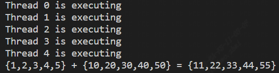

# A simple CUDA-based addition function  
This tutorial aims to demonstrate how to write a simple CUDA project, including how to write CMakeLists, .cu, and main function files.
## Environment configuration
Of course, the prerequisite is that you have already installed the CUDA toolkit and your host has at least one NVIDIA graphics card. If you are unsure, you can use 'nvidia-smi' to check the driver version and graphics card status.
  
Also, you can use 'nvcc -V' to check the version of the CUDA toolkit.
  
As you can see, my Linux host (running Ubuntu 20.04) has a NVIDIA T400 compute card with 4GB of memory. The version of CUDA toolkit is 10.1. Before using the CUDA toolkit, make sure that the corresponding versions of the compilers (gcc and g++) match. Generally speaking, if your versions of gcc and g++ are too high, you can use the following method to downgrade to gcc-7 and g++-7 as an example:
```bash
# Check the current version of gcc
gcc --version
# Downgrade the versions of g++ and gcc
sudo apt-get update
sudo apt-get install gcc-7 g++-7
sudo update-alternatives --install /usr/bin/gcc gcc /usr/bin/gcc-7 100
sudo update-alternatives --install /usr/bin/g++ g++ /usr/bin/g++-7 100
# Check the version of gcc after downgrading
gcc --version
```
## Usage
```bash
git clone https://github.com/Kevindurant111/my_cuda_tutorials.git
cd my_cuda_tutorials/tutorial_1/
mkdir build
cd build
cmake ..
make
./cuda_example
```
Hopefully, you should see the following output:  
  
## Knowledge points  
### Cuda function  
__global\_\_ is a keyword used in CUDA programming language to indicate a function that is to be executed on the GPU. In CUDA, programs are executed on a device called a GPU (Graphics Processing Unit), which has thousands of cores that can work in parallel. The __global__ keyword is used to specify a function that will be launched on the device and executed by many threads in parallel.  
The general syntax of a CUDA kernel function (a function that is executed on the GPU) looks like this:
```bash  
__global__ void myKernelFunction(parameters) {
    // Kernel code
}
```  
In the __global\_\_ function, you can use the built-in variables blockIdx and threadIdx to access the block and thread index to which the current thread belongs. blockIdx is a three-dimensional vector containing the index of the current block in the grid, and threadIdx is a three-dimensional vector containing the index of the current thread in the block. For example:  
```bash
__global__ void myKernelFunction(...) {
    int blockId = blockIdx.x; // Accessing the x-index of a block
    int threadId = threadIdx.x; // Accessing the x-index of a thread
}
```  
In the above example, blockIdx.x and threadIdx.x indicate the block to which the current thread belongs and the index of the thread in the block to which it belongs, respectively. These indexes can be used to calculate the thread's task as well as to determine where in memory the thread is accessing data. Note that both blockIdx and threadIdx are three-dimensional vector types, containing x, y, and z coordinates, respectively(In fact, they are always one-dimensional. The design as a three-dimensional structure is just to make them able to meet more computational requirements).  
A __global\_\_ function can be started by
```bash  
myKernelFunction<<<numBlocks, threadsPerBlock>>>(...);
```  
where numBlocks is the number of blocks in the grid and threadsPerBlock is the number of threads in each block. In the above example, myKernelFunction will start numBlocks * threadsPerBlock threads, which will be executed in parallel on the GPU device. In this example, we use addKernel by calling it with one block and five thread.  
### Cuda variables  
- In CUDA, __threadIdx__ is an internal variable that provides the index of the thread within its block. In a __global\_\_ function, threads are organized into a three-dimensional grid, and each block has a three-dimensional coordinate (blockIdx.x, blockIdx.y, blockIdx.z) indicating its position in the grid. Within each block, threads are organized into a three-dimensional structure, and each thread has a three-dimensional coordinate (threadIdx.x, threadIdx.y, threadIdx.z) indicating its position within its block. It should be noted that it starts from 0.    
- In CUDA, __blockIdx__ is an internal variable used to access the index of the block in the grid. In a __global\_\_ function, threads are organized into a three-dimensional grid, and each block has a three-dimensional coordinate (blockIdx.x, blockIdx.y, blockIdx.z) indicating its position in the grid. The blockIdx variable is another internal variable that provides the index of each block along each axis. It should be noted that it starts from 0.   
- In CUDA, __blockDim__ is an internal variable used to access the size of each block(number of threads). In a __global\_\_ function, threads are organized into a three-dimensional grid, and each block has a three-dimensional coordinate (blockIdx.x, blockIdx.y, blockIdx.z) indicating its position in the grid. The blockDim variable is another internal variable that provides the size of each block along each axis. In cuda, if blockDim.y and blockDim.z are not specified, they default to 1. You can use the dim3 structure to specify them, for example:  
    ```bash
    dim3 block_dim(32, 32, 1);
    my_kernel<<<1, block_dim>>>(...);
    ```  
- In CUDA, __girdDim\_\_ is an internal variable used to access the size of each gird(number of blocks).  
### Three different ways to access threads  
- one-dimensional approach  
```bash
__global__ void myKernelFunction(...) {
    int tid = threadIdx.x + blockIdx.x * blockDim.x;
}
```  
- two-dimensional approach
```bash
__global__ void myKernelFunction(...) {
    int tid = threadIdx.y * blockDim.x + threadIdx.x + blockIdx.x * blockDim.x * blockDim.y;
}
```  
- three-dimensional approach
```bash  
__global__ void myKernelFunction(...) {
    int tid = threadIdx.z * blockDim.x * blockDim.y + threadIdx.y * blockDim.x + threadIdx.x + blockIdx.x * blockDim.x * blockDim.y * blockDim.z;
}
```  
In this example, we use a one-dimensional approach to access threads, as we only need to add elements of a one-dimensional array.  
### Thread, block, grid and warp  
In CUDA programming, there are some important concepts, including thread, thread block, grid, and warp.

- A thread is the most basic unit of execution in CUDA, and each thread can independently execute some calculations. Threads can read and write global memory, shared memory, and read-only memory, and can also use registers and thread-local memory to store data. Each thread has a unique thread ID, which can be obtained using threadIdx. 

- A block is a collection of threads that execute on the same SM and can use shared memory for collaboration. The thread block has a unique block ID, which can be obtained using blockIdx, and a fixed limit on the number of threads, which can be obtained using blockDim. In CUDA, the maximum number of threads that can be contained in a block is determined by the computing capability of the device, the size of the thread block, and the memory requirements. Specifically, each CUDA device has a maximum thread block size and maximum grid size limit. These limits depend on the hardware characteristics of the device, such as the number of SMs and the maximum number of threads per SM. For the latest CUDA architectures (such as Volta, Turing, Ampere), a block can contain up to 1024 threads. For earlier CUDA architectures (such as Kepler, Maxwell), a block can contain up to 512 threads. These limits can be queried using constants in CUDA C/C++.  

- A grid is a collection of thread blocks that can be executed in parallel on different SMs, thereby increasing parallelism. The grid has a unique grid ID, which can be obtained using gridIdx, and a fixed limit on the number of thread blocks, which can be obtained using gridDim. For the latest CUDA architectures (such as Volta, Turing, Ampere), the maximum number of thread blocks that can be launched in a single kernel launch is 2147483647. For earlier CUDA architectures (such as Kepler, Maxwell), the maximum number of thread blocks that can be launched in a single kernel launch is 65535. These limits can be queried using constants in CUDA C/C++.  

- A warp is a concept in GPU hardware, which is a group of 32 threads that execute in parallel, share the same instruction stream, and can execute the same operation in the same clock cycle. In CUDA programming, all threads in a thread block are grouped into several warps, each of which contains 32 threads. The existence of warps can improve the parallelism and efficiency of the GPU.

In CUDA programming, thread block and grid size can be set to control parallel execution. For example, a grid consisting of multiple thread blocks, each containing multiple threads, can be created and parallelized on the GPU. Using thread blocks and grids can make the program fully utilize the parallel computing capabilities of the GPU, thereby accelerating the calculation process.  
## Disclaimer
The code in this article comes from [csdn](https://blog.csdn.net/comedate/article/details/109347874), and has been appropriately modified to ensure that it compiles and runs correctly.
