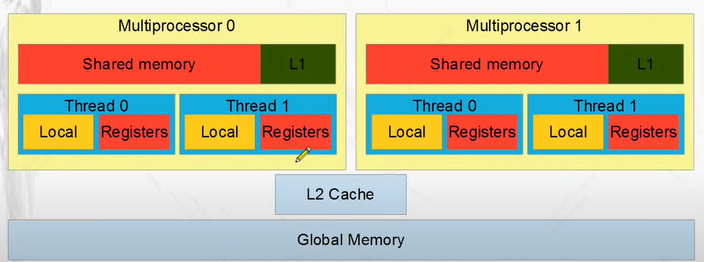

# CUDA memory  
This tutorial aims to clarify the memory concepts in CUDA.

# Table of Contents

- [Overview](#Overview)
- [Global memory](#Global-memory)
- [L2 cache](#L2-cache)
- [Shared memory](#Shared-memory)
- [L1 cache](#L1-cache)
- [Local memory](#Local-memory)
- [Registers](#Registers)
- [Constant memory](#Constant-memory)
- [Texture memory](#Texture-memory)
- [Tips](#Tips)
- [Disclaimer](#Disclaimer)

## Overview  
  

## Global memory
CUDA global memory is a type of memory available on NVIDIA GPUs that can be accessed by all threads in a CUDA kernel. It is the largest type of memory available on the GPU, but it is slower to access than other types of memory, such as shared memory or registers.  
Global memory is typically used to store input data and intermediate results that are too large to fit into shared memory or registers. Data can be read from and written to global memory using load and store operations, which are initiated by threads in the CUDA kernel.  
One important consideration when using global memory is that memory accesses should be coalesced to optimize memory bandwidth. This means that threads in a warp should access consecutive memory addresses in a way that allows the GPU to fetch data in a single memory transaction, rather than multiple transactions. Coalesced memory accesses can significantly improve the performance of memory-bound CUDA kernels.  
To declare a global variable in CUDA, you can use the "device" keyword, like this:
```bash
__device__ float myGlobalVariable;
```
You can then access this variable from any CUDA kernel running on the GPU. It's important to note that global variables declared with "device" must be initialized on the host before they can be used on the GPU.  

## L2 cache  
CUDA L2 cache, or the second-level cache, is a hardware feature on NVIDIA GPUs that can significantly improve memory performance for certain types of CUDA applications.  
L2 cache is a high-speed memory that sits between the GPU's global memory and the L1 cache. It stores frequently accessed data, such as global memory transactions and data accessed by multiple threads. When a thread requests data from global memory, the L2 cache checks if the data is already stored in the cache. If the data is present, it can be quickly accessed without having to go through the slower global memory.  
In CUDA, L2 cache is enabled by default on all compute-capable devices. However, it's important to note that not all applications can benefit from L2 cache. In fact, some applications may see a performance decrease when L2 cache is enabled, especially if the application is already optimized to use the L1 cache efficiently.  
To enable or disable L2 cache in a CUDA kernel, you can use the "launch_bounds" keyword with the "cache" attribute. For example, to disable L2 cache for a kernel, you can use the following code:  
```bash
__global__ void myKernel() __launch_bounds__(256, 0) {
    // kernel code
}
```
Here, the second parameter of the "launch_bounds" attribute is set to 0, which disables L2 cache for the kernel. If you set the second parameter to a non-zero value, such as 32, it will enable L2 cache for the kernel and set the maximum number of threads per block to 32.  

## Shared memory  
CUDA shared memory is a type of memory available on NVIDIA GPUs that can be accessed by all threads within a single block in a CUDA kernel. It is faster to access than global memory, but it is smaller in size and only accessible to threads within the same block.  
Shared memory is typically used to store intermediate results and data that are reused across multiple threads in a block. Data can be read from and written to shared memory using load and store operations, which are initiated by threads in the CUDA kernel.  
One important consideration when using shared memory is that memory accesses should be coalesced to optimize memory bandwidth. This means that threads in a warp should access consecutive memory addresses in a way that allows the GPU to fetch data in a single memory transaction, rather than multiple transactions. Coalesced memory accesses can significantly improve the performance of memory-bound CUDA kernels.  
To declare a shared variable in CUDA, you can use the "shared" keyword, like this:
```bash
__shared__ float mySharedVariable[256];
```
You can then access this variable from any thread within the same block. It's important to note that shared variables declared with "shared" are initialized in every block and are not visible to threads in other blocks.   

## L1 cache  
CUDA L1 cache, or the first-level cache, is a hardware feature on NVIDIA GPUs that can improve memory performance for certain types of CUDA applications.  
L1 cache is a small, fast memory that sits closest to the processing elements within a CUDA multiprocessor. It stores data and instructions that are frequently accessed by a single thread. When a thread requests data from global memory, the L1 cache checks if the data is already stored in the cache. If the data is present, it can be quickly accessed without having to go through the slower global memory.  
In CUDA, L1 cache is enabled by default on all compute-capable devices. However, not all applications can benefit from L1 cache. In fact, some applications may see a performance decrease when L1 cache is enabled, especially if the application is already optimized to use shared memory efficiently.  

## Local memory  
CUDA local memory is a type of memory that is automatically allocated and managed by the compiler for each thread in a CUDA kernel. It is used to store function arguments, local variables, and temporary results that cannot be stored in registers.  
Local memory is the slowest type of memory available to threads in a CUDA kernel, so it should be used sparingly. If a thread uses more local memory than is available, the thread may be forced to use slower global memory, which can significantly reduce performance.  
One way to reduce the amount of local memory used by a kernel is to use loop unrolling or other optimization techniques to reduce the number of local variables needed. Another way is to use shared memory to store intermediate results that are shared between threads in a block.  
To declare a local variable in a CUDA kernel, you can simply declare it as you would in a regular C function. For example:
```bash
__global__ void myKernel(int arg1, float arg2) {
    int myLocalVariable;
    float anotherLocalVariable;
    // kernel code
}
```  
Here, "myLocalVariable" and "anotherLocalVariable" are local variables that are automatically allocated and managed by the compiler for each thread in the kernel.

## Registers  
CUDA registers are a type of memory available to individual threads in a CUDA kernel. They are the fastest type of memory available on the GPU and are used to store frequently accessed data, such as function arguments, loop variables, and intermediate results.  
Registers are allocated and managed automatically by the compiler for each thread in a CUDA kernel. The number of registers available to a thread depends on the GPU architecture and the specific kernel code. Each thread has a limited number of registers available, so it's important to use them efficiently to avoid register spilling, which occurs when a thread uses more registers than are available and is forced to use slower memory types such as local memory.  
One way to optimize register usage is to use loop unrolling and other optimization techniques to reduce the number of register variables needed. It's also important to avoid unnecessary memory accesses and data type conversions, which can increase register usage.  

## Constant memory  
In CUDA, constant memory is a type of read-only memory that is cached on-chip for fast access. It's designed to store data that doesn't change frequently, such as lookup tables or constant parameters used in a kernel.  
Constant memory is declared using the "constant" keyword in CUDA, and its size is limited to 64KB. It's accessed by all threads in a grid with low latency and high bandwidth, making it faster than accessing global memory.  
To use constant memory in a CUDA kernel, you must first allocate memory on the device using cudaMalloc() and then copy the data from host memory to the device constant memory using cudaMemcpyToSymbol(). Once the data is in constant memory, it can be accessed directly by all threads in the kernel.  
It's important to note that the use of constant memory is optional, and not all CUDA applications can benefit from it. However, for applications that frequently use read-only data, constant memory can provide a significant performance boost.  

## Texture memory  
In CUDA, texture memory is a special type of read-only memory that is optimized for 2D and 3D spatial locality. It's designed to store data that is accessed in a regular pattern, such as image or video data. Texture memory is cached on-chip for fast access and can be accessed by all threads in a grid with low latency and high bandwidth.  
Texture memory is declared using the "texture" keyword in CUDA, and its size is limited to 2D or 3D dimensions. It's accessed by threads using special texture fetching functions, such as tex1Dfetch() or tex2D().  
To use texture memory in a CUDA kernel, you must first allocate memory on the device using cudaMallocArray() and then bind the memory to a texture using cudaBindTexture(). Once the texture is bound, threads can access it using the texture fetching functions.  
It's important to note that the use of texture memory is optional, and not all CUDA applications can benefit from it. However, for applications that frequently access 2D or 3D spatially-local data, texture memory can provide a significant performance boost over global memory or constant memory.  

## Tips
- The memory type (local memory or register memory) for variables declared in a global function is automatically determined by the compiler and cannot be specified. Specifically, when register memory is exhausted, the compiler will allocate local memory.  
- The use of L1 cache and L2 cache can be specified using the launch_bounds parameter.  
- Access speed: Register memory > L1 cache > Shared memory > L2 cache > Local memory > Global memory

## Disclaimer  
The resources of this tutorial are from online videos on YouTube [NVIDIA CUDA Tutorial 5: Memory Overview](https://www.youtube.com/watch?v=RY2_8wB2QY4&t=205s).