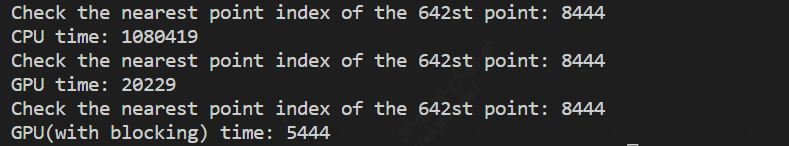

# Solving an embarrassingly parallel problem using CUDA  
This tutorial aims to demonstrate how to solve embarrassingly parallel problems using CUDA, and we will use the nearest neighbor problem as an example.  

# Table of Contents

- [Embarrassingly Parallel Algorithms](#Embarrassingly-Parallel-Algorithms)
- [Nearest neighbor problem](#Nearest-neighbor-problem)
    - [C++ code for solving the nearest neighbor problem](#C++-code-for-solving-the-nearest-neighbor-problem)
    - [CUDA C code for solving the nearest neighbor problem](#CUDA-C-code-for-solving-the-nearest-neighbor-problem)
- [Blocking with shared memory](#Blocking-with-shared-memory)
- [Usage](#Usage)
- [Disclaimer](#Disclaimer)

## Embarrassingly Parallel Algorithms  
"Embarrassingly Parallel Algorithms" refers to algorithms that can easily be transformed into independent or completely independent subproblems, allowing them to be executed independently on multiple processors. Such algorithms typically exhibit high parallelism and can achieve linear speedup in multi-processor environments.  
Typical embarrassingly parallel algorithms include:  
- Parallel sorting: divide the data to be sorted into multiple subsets, and each processor independently sorts the subsets. Finally, the sorted subsets are merged to obtain the ordered result.  
- Matrix computation: for operations such as matrix multiplication and transposition, the matrix can be divided into multiple sub-blocks, and each processor independently calculates the operation results between the sub-blocks.  
- Image processing: for some image processing algorithms such as image filtering and segmentation, the image can be divided into multiple sub-blocks, and each processor independently processes the sub-blocks.  
- Monte Carlo simulation: in Monte Carlo simulation, each random sampling process can be independently allocated to different processors for calculation, and all results can be combined to obtain an overall estimate.  
- It should be noted that even for embarrassingly parallel algorithms, it is important to pay attention to task load balancing and data partitioning to avoid tasks being too heavy on certain processors, which can affect the overall program performance. In addition, when implementing parallel algorithms, it is also important to pay attention to the overhead of parallelization, to avoid additional time and space overhead caused by parallelization exceeding the computational overhead itself.  

## Nearest neighbor problem
The nearest neighbor problem refers to finding the data point in a given dataset that is closest to a query point based on a specified distance metric. This problem often arises in machine learning, data mining, computational geometry, and other fields, and is a foundation for many algorithms and applications.  
The nearest neighbor problem can be solved using different distance metrics, such as Euclidean distance, Manhattan distance, and Chebyshev distance. In practical applications, it is often necessary to perform nearest neighbor queries on large datasets, so efficient algorithms and data structures are required to support fast queries.  
Some common nearest neighbor algorithms include brute-force search, kd-tree algorithm, and ball tree algorithm. Brute-force search is a simple but inefficient method that requires computing the distances between all data points and the query point, with a time complexity of O(N). The kd-tree algorithm and ball tree algorithm are more efficient methods that can reduce the query time to between O(log N) and O(sqrt(N)).  
It is worth noting that the nearest neighbor problem is a typical embarrassingly parallel problem, and parallel computing technologies such as CUDA can be used to accelerate the query process.  

### C++ code for solving the nearest neighbor problem  
```bash
void FindClosestCPU(float3 * points, int* indices, int count) {
    if(count <= 1) {
        return;
    }
    for(int curPoint = 0; curPoint < count; curPoint++) {
        float distToClosest = 3.40282e38f;
        for(int i = 0; i < count; i++) {
            if(i == curPoint) {
                continue;
            }
            float dist = sqrt((points[curPoint].x - points[i].x) * (points[curPoint].x - points[i].x) +
            (points[curPoint].y - points[i].y) * (points[curPoint].y - points[i].y) +
            (points[curPoint].z - points[i].z) * (points[curPoint].z - points[i].z));
            if(dist < distToClosest) {
                distToClosest = dist;
                indices[curPoint] = i;
            }
        }
    }
}
```  
__points__ stores the three-dimensional coordinates of each point, __indices__ represent the indices of the nearest points for each point, __count__ represents the number of points, and __dist__ represents the Euclidean distance between two points.

### CUDA C code for solving the nearest neighbor problem  
```bash
__global__ void FindClosestGPU(float3* points, int* indices, int* count) {
    if(*count <= 1) {
        return;
    }

    int idx = threadIdx.x + blockIdx.x * blockDim.x;
    if(idx < *count) {
        float distToClosest = 3.40282e38f;
        for(int i = 0; i < *count; i++) {
            if(i == idx) {
                continue;
            }
            float dist = sqrt((points[idx].x - points[i].x) * (points[idx].x - points[i].x) +
            (points[idx].y - points[i].y) * (points[idx].y - points[i].y) +
            (points[idx].z - points[i].z) * (points[idx].z - points[i].z));
            if(dist < distToClosest) {
                distToClosest = dist;
                indices[idx] = i;
            }
        }
    }
}
```  
- It is worth noting that the __count__ parameter form here is also a pointer. The parameters of global functions are usually pointers to device memory. Therefore, in most cases, declaring the parameters of global functions as pointers to device memory is the best choice because it allows the global function to access the data in device memory. In addition, pointers make it easy to pass large amounts of data without the need for explicit data transfers between the host and device.  
However, for some simple cases, parameters can also be declared as basic types such as integers or floating-point numbers. But this case is usually used only when the parameter quantity is small and the data amount is also small. If a large amount of data needs to be processed, using pointers as parameters is a better choice.  

## Blocking with shared memory  
CUDA blocking technique is a method to optimize GPU computing performance, especially for memory-bound tasks. In CUDA, a block consists of a group of threads, and blocks are organized into a grid. The goal of CUDA blocking technique is to improve GPU computing efficiency by optimizing the usage of shared memory and data access patterns within a block.  
The core idea of CUDA blocking technique is to reduce the number of accesses to global memory, which is relatively slower, by utilizing shared memory, which is faster. By loading data from global memory to shared memory and performing computations on shared memory, the number of global memory accesses can be reduced, thus improving performance.  
The CUDA blocking technique typically involves the following steps:  
- Data loading: Load the data to be processed from global memory to shared memory. This can be done by multiple threads within a block, with each thread loading a portion of the data.  
- Data computation: Within the block, threads can perform computations on the data stored in shared memory. Since accessing shared memory is faster, it reduces the latency associated with accessing global memory.  
- Data storing: Write the computed results back from shared memory to global memory. Similar to data loading, this can be achieved through the collaboration of multiple threads, with each thread responsible for writing back a portion of the data.  
Using this approach, the CUDA program can be further optimized by:  
```bash
__global__ void FindClosestGPUWithBlocking(float3* points, int* indices, int* count) {
    __shared__ float3 sharedPoints[blockSize];
    if(*count <= 1) {
        return;
    }

    int idx = threadIdx.x + blockIdx.x * blockDim.x;
    float3 thisPoint;
    float distToClosest = 3.40282e38f;
    if(idx < *count) {
        thisPoint = points[idx];

        for(int currentBlockOfPoints = 0; currentBlockOfPoints < gridDim.x; currentBlockOfPoints++) {
            if(threadIdx.x + currentBlockOfPoints * blockSize < *count) {
                sharedPoints[threadIdx.x] = points[threadIdx.x + currentBlockOfPoints * blockSize];
                __syncthreads();
            }
            
            for(int i = 0; i < blockSize; i++) {
                if(i + currentBlockOfPoints * blockSize == idx) {
                    continue;
                }
                float dist = sqrt((thisPoint.x - sharedPoints[i].x) * (thisPoint.x - sharedPoints[i].x) +
                (thisPoint.y - sharedPoints[i].y) * (thisPoint.y - sharedPoints[i].y) +
                (thisPoint.z - sharedPoints[i].z) * (thisPoint.z - sharedPoints[i].z));
                if((dist < distToClosest) && (i + currentBlockOfPoints * blockSize < *count)) {
                    distToClosest = dist;
                    indices[idx] = i + currentBlockOfPoints * blockSize;
                }
            }
            __syncthreads();
        }
    }
}
```  
In the code above, we divided the global memory into groups of 640 blocks and copied them to shared memory. In each iteration, we first update the content of the shared memory, and then all points check the distances with the 640 points on the current shared memory and update their nearest point indices. It is not difficult to verify its correctness. Additionally, we can observe that this method speeds up significantly compared to not using blocking.  

## Usage  
```bash
git clone https://github.com/Kevindurant111/my_cuda_tutorials.git
cd my_cuda_tutorials/tutorial_3/
mkdir build
cd build
cmake ..
make
./cuda_example
```  
Hopefully, you should see the following output:  
  

## Disclaimer  
The resources of this tutorial are from online videos on YouTube [NVIDIA CUDA Tutorial 6: An Embarrassingly Parallel Algorithm 1](https://www.youtube.com/watch?v=0ILeCeaor0A&list=PLKK11Ligqititws0ZOoGk3SW-TZCar4dK&index=6).