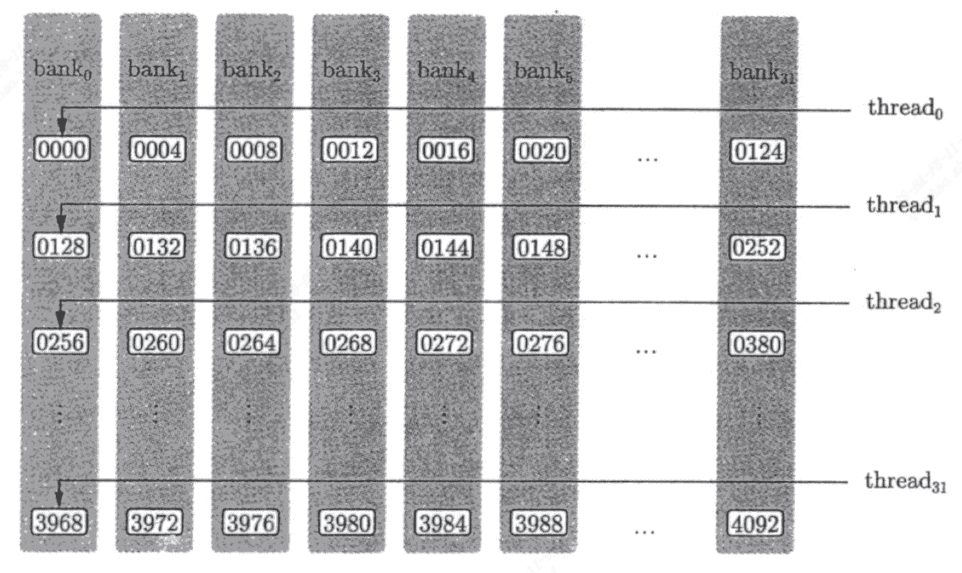
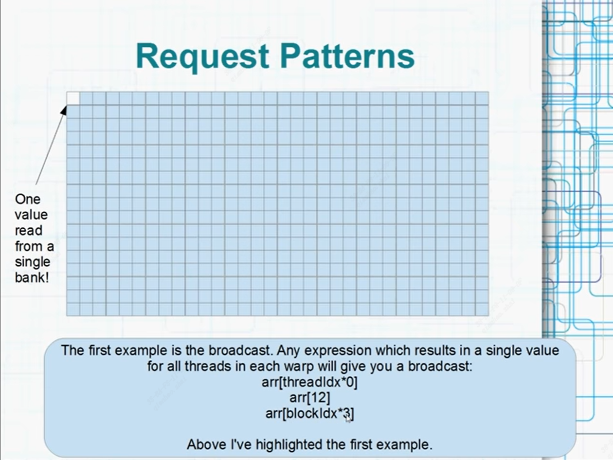
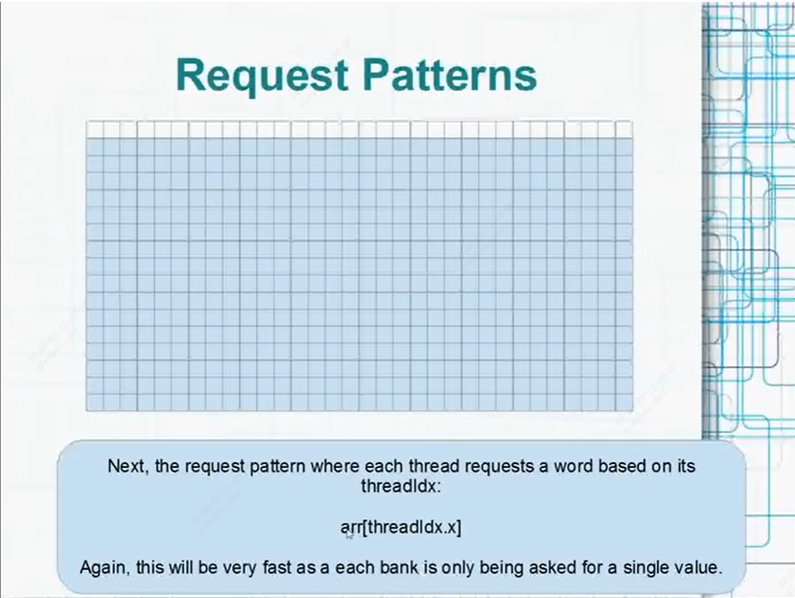
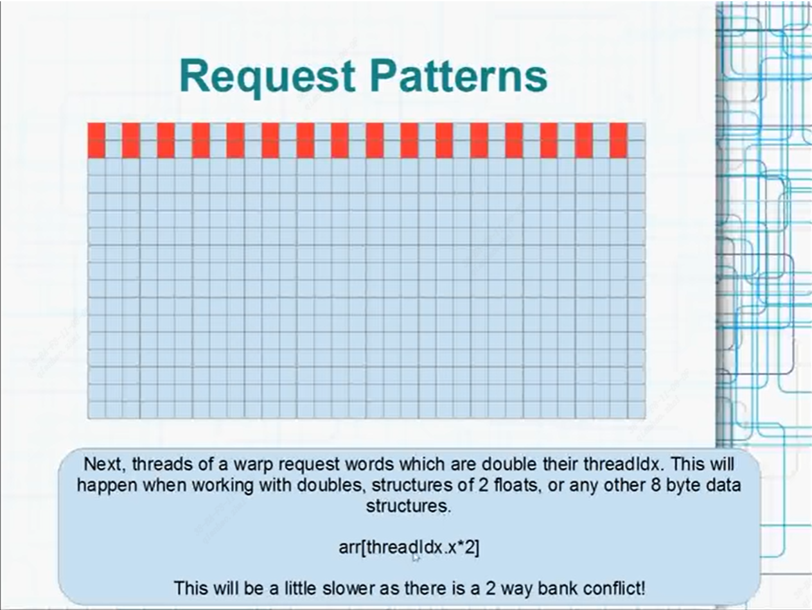
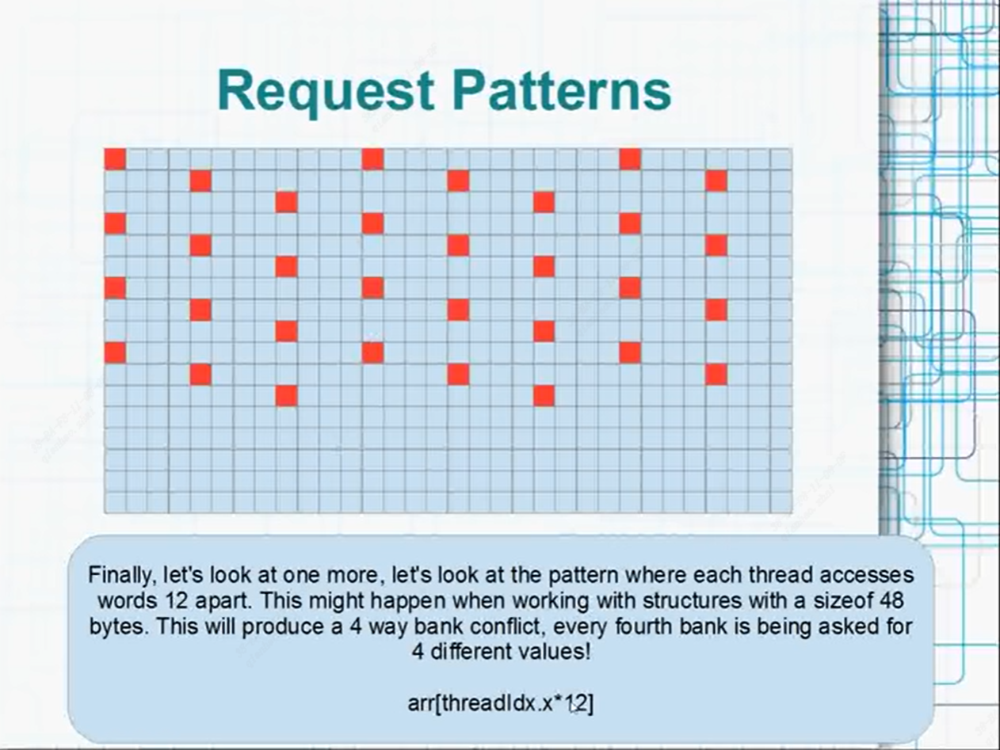

# Bank Conflicts  
In this tutorial, we will introduce an important concept: bank conflicts. Understanding and mastering the solution to this problem will be a key step for learning CUDA.

# Table of Contents

- [Concept of bank conflicts](#Concept-of-bank-conflicts)
- [Some examples of bank conflicts and non-bank conflicts](#Some-examples-of-bank-conflicts-and-non-bank-conflicts)
    - [Accessing the same value in the same bank](#Accessing-the-same-value-in-the-same-bank)
    - [Accessing the same row in the different bank](#Accessing-the-same-row-in-the-different-bank)
    - [Accessing the different value in the same bank](#Accessing-the-different-value-in-the-same-bank)
- [How to resolve bank conflicts](#How-to-resolve-bank-conflicts)
- [Disclaimer](#Disclaimer)

## Concept of bank conflicts  
Before we start with this concept, let's review the concept of "warp". Simply put, threads within the same block are grouped into sets of 32, and each set is called a "warp". In tut2, we learned that threads within the same block can access a shared memory. In fact, to achieve high memory bandwidth, the shared memory is physically divided into 32 equally sized and accessible memory banks (exactly the same width as a thread bundle, or the value of the built-in variable "warpSize"). In the Kepler architecture, the width of each bank is 8 bytes, while in all other architectures, the width of each bank is 4 bytes. Without loss of generality, we assume that the width of each bank is 4 bytes, i.e., one word is 4 bytes. In shared memory, the storage of words is performed in a manner similar to "row-major" order. That is, the first word is placed in the first bank, the second word in the second bank, and so on. The 33rd word would be placed in the first bank again, and so on.  
A bank conflict is a conflict caused when different threads in a warp access different words in the same bank at the same time, which can result in slower access times. Note that in the case of accessing the same word in the same bank, bank conflicts do not occur in this case due to the broadcast mechanism.  
As shown in the figure below, when thread0 accesses the word at address 0000 and thread1 accesses the word at address 0128, a bank conflict will occur at this time. However, if they both access the word at address 0000, there will be no bank conflict.  

## Some examples of bank conflicts and non-bank conflicts  
In the following, we will give some specific examples of bank conflicts and non-bank conflicts to be able to illustrate the problem more intuitively.  

### Accessing the same value in the same bank  
Assuming we have a shared memory __arr__ whose basic unit is a word (4 bytes), we access it in the following three ways::  
- arr[threadIdx * 0]
- arr[12]
- arr[blockIdx * 3]  

threadIdx * 0 is always 0, so all threads will access arr[0]. And the blockIdx in the same warp are all the same, so this is also the same word. According to the previous description, no bank conflicts occur in all three cases due to the broadcast mechanism.  

### Accessing the same row in the different bank  
Next, we will consider another scenario. If different threads in the same warp access arr[threadIdx.x], since threadIdx.x increases in increments of 0, 1, ..., 31, they will access words in different banks. Naturally, this will not result in bank conflicts.  
  

### Accessing the different value in the same bank  
What about the following two scenarios? For example, if threads in the same warp access arr[threadIdx.x * 2], the first thread will access arr[0], the seventeenth thread will access arr[32], and they both belong to the first bank, which will cause bank conflicts. Similarly, accessing arr[threadIdx.x * 4] will also cause bank conflicts, and it will be more severe.  
  
  

## How to resolve bank conflicts  
In CUDA, there are several ways to reduce or avoid bank conflicts. Below are two common approaches provided:  
- Use different shared memory layouts, such as column-major storage (also known as "bank grouping"), which allows different threads to access different banks and avoid bank conflicts.  
- Optimize shared memory access patterns to allow threads to access different banks, such as through loop unrolling or using different indexing methods to make threads access different banks.  

## Disclaimer  
The resources of this tutorial are from online videos on YouTube [NVIDIA CUDA Tutorial 9: Bank Conflicts](https://www.youtube.com/watch?v=CZgM3DEBplE&t=965s).