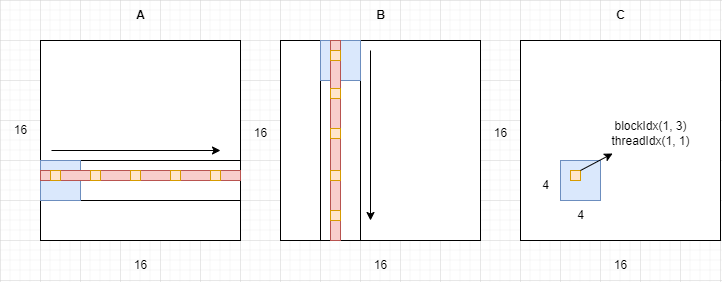
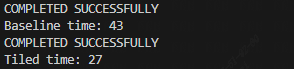

# Matrix multiplication in CUDA  
This section demonstrates how to use CUDA to accelerate matrix multiplication. We show both the baseline version and the version using tiling technique.  

# Table of Contents

- [Baseline](#Baseline)
- [Tiled matrix multiplication](#Tiled-matrix-multiplication)
- [Usage](#Usage)
- [Disclaimer](#Disclaimer)  

## Baseline  
We all know that matrix multiplication is essentially the sum of element-wise products between the corresponding rows and columns. For example, if A * B = C, then the element in the 1st row and 2nd column of C comes from the sum of element-wise products between the 1st row of A and the 2nd column of B. So, a very simple design idea emerged: we only need to assign a thread to each element of matrix C, and let it calculate the corresponding sum of element-wise products. The baseline code is as follows. Note that in this example, we assume that both A and B are square matrices of the same size, and the thread block size exactly matches the size of matrix C (i.e., the number of rows and columns of C can be evenly divided by blockDim.y and blockDim.x).  
```
__global__ void matrixMul(const int *a, const int *b, int *c) {
  int row = blockIdx.y * blockDim.y + threadIdx.y;
  int col = blockIdx.x * blockDim.x + threadIdx.x;

  c[row * N + col] = 0;
  for (int k = 0; k < N; k++) {
    c[row * N + col] += a[row * N + k] * b[k * N + col];
  }
}
```  
In the above code, a, b, and c are all the starting addresses of one-dimensional arrays, and the matrices are stored in row-major order. a and b are inputs, and c is the output, i.e., a * b = c.

## Tiled matrix multiplication  
Earlier we introduced the blocking optimization technique. In fact, the definitions of tile and blocking are ambiguous. According to ChatGPT's answer, blocking is a technique for dividing global memory into blocks, while tile is for shared memory. Here, we consider these two terms to refer to the same technique, which is to decompose a large matrix into multiple small matrices (tiles) and assign each small matrix to a thread block for computation. The advantage of this technique is that it can use shared memory to improve the efficiency of accessing matrix elements, while reducing the amount of global memory access, thus speeding up the computation process.  
```  
__global__ void tiledMatrixMul(const int *a, const int *b, int *c) {
  int row = blockIdx.y * blockDim.y + threadIdx.y;
  int col = blockIdx.x * blockDim.x + threadIdx.x;

  __shared__ int s_a[SHMEM_SIZE];
  __shared__ int s_b[SHMEM_SIZE];

  int tmp = 0;

  for (int i = 0; i < N; i += blockDim.x) {
    s_a[threadIdx.y * blockDim.x + threadIdx.x] = a[row * N + i + threadIdx.x];
    s_b[threadIdx.y * blockDim.x + threadIdx.x] =
        b[i * N + threadIdx.y * N + col];

    __syncthreads();

    for (int j = 0; j < blockDim.x; j++) {
      tmp +=
          s_a[threadIdx.y * blockDim.x + j] * s_b[j * blockDim.x + threadIdx.x];
    }

    __syncthreads();
  }

  c[row * N + col] = tmp;
}
```  
The schematic diagram using tile technology is shown below. Here's a simple example: Let AB=C, where A, B, and C are 16*16 square matrices, and each block has a size of 4*4 (which is also the tile size). Now, we have a thread with a block index of (1, 3) and a thread index of (1, 1). The row index of this thread is calculated as 3*4+1=13, and the column index is calculated as 1*4+1=5.  
Next, let's explain what this thread does in each iteration. We can abstract this process as the block moving from left to right along the corresponding row in matrix A, shifting by 4 units each time. Simultaneously, it moves from top to bottom along the corresponding column in matrix B by 4 units each time. During each movement of the block, this thread copies the data relative to the current block position into shared memory (depicted as the yellow part in the diagram). It then multiplies the corresponding row and column's four data elements in the shared memory and accumulates them into the variable "tmp." In the end, each element in the 14th row and the 6th row of matrix A is multiplied and added together, and the result is stored in the corresponding element of matrix C(Note that there is a difference of 1 between the actual number of rows and the row index, because the row index starts from 0).


## Usage  
```bash
nvcc -ccbin gcc-7 MatrixMul.cu -o MatrixMul -lstdc++
./MatrixMul
```  
Hopefully, you should see the following output: 


## Disclaimer  
The resources of this tutorial are from online videos on YouTube [CUDA Crash Course: Cache Tiled Matrix Multiplication](https://www.youtube.com/watch?v=3xfyiWhtvZw&list=PLxNPSjHT5qvtYRVdNN1yDcdSl39uHV_sU&index=4&t=634s).